# ComProtein
Proteins serve as the functional building blocks of life, facilitating critical tasks such as signaling, catalysis, and structural support in all living organisms. Designing proteins with targeted biological features or domains is of utmost importance. Traditional wet-lab experiments are time-consuming and resource-intensive, which makes deep learning (DL) methods ideal alternatives. However, existing DL methods predominantly focus on generating new proteins with the same biological domain as the training data, and overlook some scenarios where designers expect to combine proteins from different biological domains to create novel proteins with both features, which can show better fits for practical purpose. To fill this gap, in this paper, we present \textsc{ComProtein}, a novel framework further exploiting the potential of pre-trained protein large language models, which is the \textit{first} work aiming to generate innovative proteins with combinative biological features from two different domains. This process is performed by a cycle-consistent generative adversarial approach, leveraging insights from the latent space. It enables the transformation of protein representations from one biological domain to another, while preserving their intrinsic features. Additionally, we introduce new evaluative metrics, namely Shortest Target Neighbor Distance (STND), Mutual Root Mean Square Deviation (MRMSD) and Sequence Diversity (SD) on the evaluation of biological representations, protein structure and sequence quality, respectively to complement the existing measures. Our experimental results demonstrate that our proposed method performs better and has great potential in biological representations, structure similarity, homology relationships, and sequence quality.

It's our great hornor to get you attention to our work ComProtein. Pre-trained checkpoints and splited data will be available once acceptance and more details will be added soon.

# Model Architecture

# Closely Related Generation
|  |  |  |  |
|---|---|---|---|
| 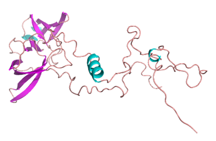   | 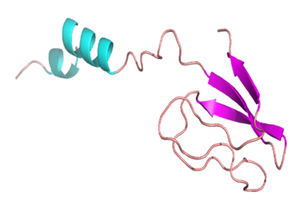 | 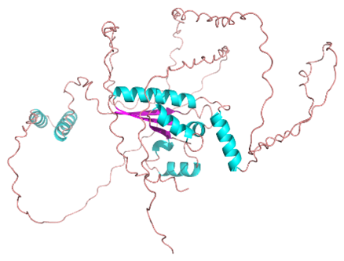   | 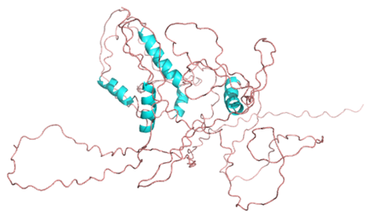 |
| (a) Domain A - A   | (b) Domain A - B | (c) Domain B - A   | (d) Domain B - B |
| 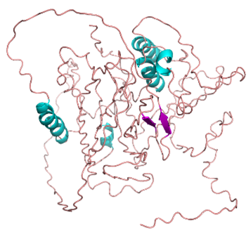  | 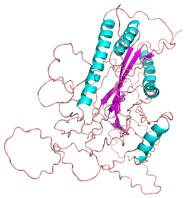  | 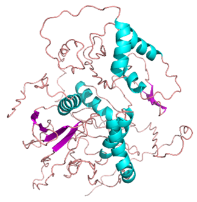 | 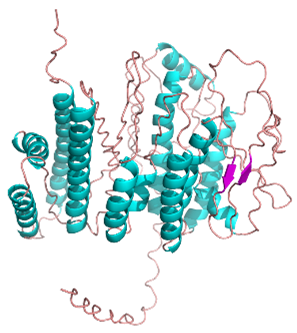 |
| (a) Generated - A   | (b) Generated - B | (c) Generated - C   | (d) Generated - D |

# Distantly Related Generation
|  |  |  |  |
|---|---|---|---|
| 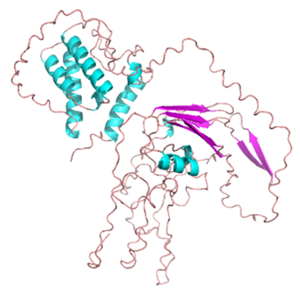   | 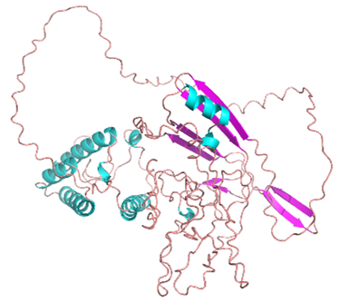 | 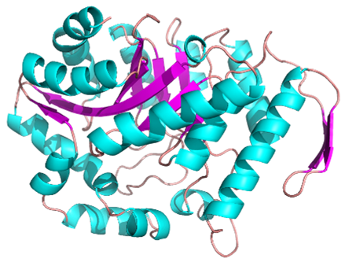   | 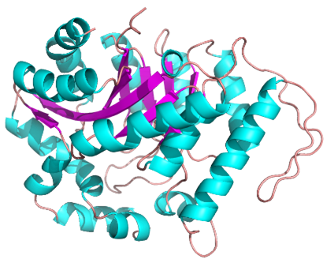 |
| (a) Domain A - A   | (b) Domain A - B | (c) Domain B - A   | (d) Domain B - B |
| 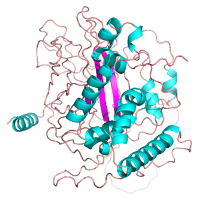  | 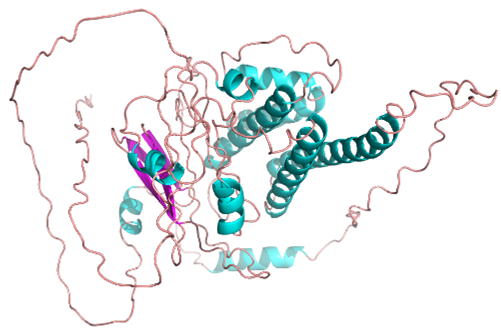  | 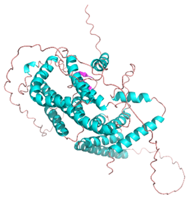 | 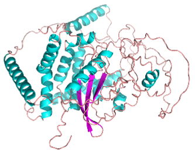 |
| (a) Generated - A   | (b) Generated - B | (c) Generated - C   | (d) Generated - D |
